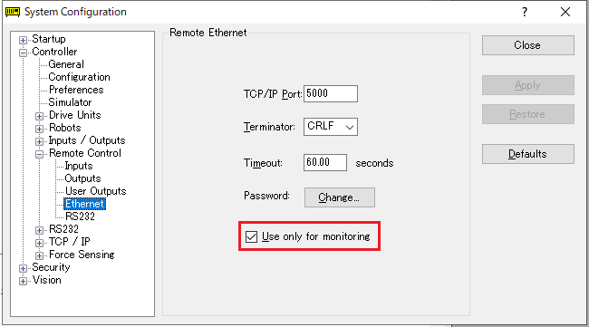

# node-red-contrib-epson-robot

English / [日本語](./README_ja.md) / [简体中文](./README_zh-CN.md) / [繁體中文](./README_zh-TW.md)

This is a Node-RED node for Epson SCARA/6-axis robot.

The package includes `status-monitor` node and the sample flow which are useful for monitoring the robot operations.

For details on Epson robots, refer to the supplier page of your region on [This page](https://global.epson.com/products/robots/). Also check our videos in [YouTube channel](https://www.youtube.com/channel/UCmgC2Kabv6p5ioMPH71U0PQ/). 

## Installation

Either use [Menu]-[Manage pallet] option in Node-RED editor or execute the following command in Node-RED user directory (normally, `~/.node-red`).

        npm i @epson-robots/node-red-contrib-epson-robot

Execution environment of this node is Node-RED v1.0 or later.

## Usage

The node `status-monitor` connects to the robot controller via network and regularly collects/outputs various data related to the state of the robot and the controller.

Do the following advance preparation for controllers to be connected, and in the Node-RED editor, enter the setting information related to the connection destination controller in the edit dialog of this node and deploy.

For specifications of the node input/output, see the help text of the node in Node-RED editor.

### Advance preparation

Follow the steps below to enable "Remote Ethernet" function for information acquisition of the robot controllers.

1. Connect the PC installed EPSON RC+ to the target robot controller, and open System Configuration window of the controller.
1. Check the IP address on [Controller]-[Configuration] window.
1. Select the [Enable robot maintenance data] check box in [Controller]-[Preferences]. (Option: configure it if maintenance data is required)
    * **Reference**: Months Remaining and Consumption that are output as the maintenance data is automatically calculated in the controller based on the various information of robot motions.
    * **Caution**: Maintenance data is executed once by this node right after connection. Subsequent re-acquisitions will be executed every 24 hours. 
    The acquisition of information on component wear by this node is executed once immediately after connection. Subsequent re-acquisitions will be every 24 hours. It is not affected by the output time interval configured in the edit dialog of the node on the editor.
1. Open [Controller]-[Remote Control]-[Ethernet].
1. Select the [Use only for monitoring] check box.
    * 
1. Check the port and terminator (change if necessary). Set password if required.
    * **Caution**: The timeout value (default: 60.00 seconds) should be greater than the output time interval set in the edit dialog of the node on the editor.

When those settings are changed, the controller will reboot.

#### Cautions

* Do not set Control Device to "Remote Ethernet".
* If there are other client terminals that use Remote Ethernet communication for the controller, they cannot be used at the same time.

### Operating environment

This node operates on the following robot controllers and firmware versions. This node will operate with previous firmware versions, but the information that can be obtained will be limited.

|Robot Controller|Firmware version|
|:--|:--|
|RC700 series|Ver.7.4.7.2 or later|
|RC90series|Ver.7.4.7.2 or later|
|T series (robot and controller integrated)|Ver.7.4.57.5 or later|
|VT series (robot and controller integrated)|Ver.7.4.57.5 or later|
|EPSON RC+ virtual controller|Ver.7.4.8 or later|

#### Cautions

* Depending on a controller and a connected robot, some information cannot be acquired.
* In EPSON RC+ virtual controller, the information such as maintenance data and CPU load factor even in the above version or later.
* The maximum continuous operation time of EPSON RC+ virtual controller is 60 minutes.

## Example

The package contains a sample flow that visualizes the data collected by the `status-monitor` node on the Node-RED Dashboard (installation of the `node-red-dashboard` package is required).

Select this package from [Menu]-[Import]-[Example] on Node-RED editor and import the displayed sample flow.

For usage, see the description of `comment` node included in the flow.

## Feedback

Please send bug reports, feedbacks, and questions to [GitHub Issues](https://github.com/Epson-Robots/node-red-contrib-epson-robot/issues).