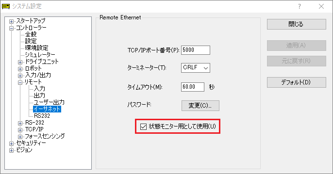

# node-red-contrib-epson-robot

日本語 / [English](./README.md) / [简体中文](./README_zh-CN.md) / [繁體中文](./README_zh-TW.md)

エプソン製 スカラ型/垂直6軸型ロボット用Node-REDノードです。

ロボットの状態監視に便利な`status-monitor`ノードとサンプルのフローが含まれます。

エプソンのロボット製品については、[こちらのページ](https://global.epson.com/products/robots/)から、お住まいの地域の販売会社のページを参照してください。[YouTubeチャネル](https://www.youtube.com/channel/UCmgC2Kabv6p5ioMPH71U0PQ/)の動画もご覧ください。

## インストール

Node-REDエディタの[メニュー]-[パレットの管理]オプションを使用するか、Node-REDユーザーディレクトリ (通常は `~/.node-red`)で、以下のコマンドを実行してください。

        npm i @epson-robots/node-red-contrib-epson-robot

なお、本ノードの実行環境は、Node-RED v1.0以降となります。

## 使用方法

`status-monitor`ノードは、ネットワーク経由でロボットコントローラーに接続し、ロボットとコントローラーの状態に関する様々なデータを、定期的に収集して出力します。

接続するコントローラーに対して以下の事前準備を行い、Node-REDエディタでは、本ノードの編集ダイアログで接続先コントローラーに関する設定情報を入力してデプロイしてください。

ノードの入出力の仕様については、Node-REDエディタでノードのヘルプテキストを参照してください。

### 事前準備

以下の手順でロボットコントローラーが持つ情報取得用の"リモートイーサーネット"機能を有効にします。

1. EPSON RC+がインストールされたPCと、対象のロボットコントローラーとを接続し、コントローラーのシステム設定画面を開く
1. [コントローラー]-[設定]画面でコントローラーのIPアドレスを確認する
1. [コントローラー]-[環境設定]画面で[ロボット部品消耗管理を有効]をチェックする (オプション:部品消耗管理に関する情報が必要な場合は、設定する)
    * **参考**: 部品消耗管理情報として出力される残月数と消耗度は、ロボットの動作にともなう様々な情報を基に、コントローラー内部で自動的に計算されたデータです。
    * **注意**: 本ノードによる部品消耗に関する情報の取得は、接続直後に1回実行されます。その後の再取得は、24時間ごとになります。エディタ上のノードの編集ダイアログで設定した出力時間の間隔には、影響されません。
1. [コントローラー]-[リモート]-[イーサネット]画面を開く
1. [状態モニター用として使用]にチェックする
    * 
1. ポート番号、ターミネーターを確認する (必要な場合は変更する) パスワードは、必要な場合は設定する
    * **注意**: タイムアウトの値 (デフォルト：60.00秒)は、エディタ上のノードの編集ダイアログで設定する出力時間の間隔よりも大きい値になるようにしてください。

これらの設定を変更すると、コントローラーは再起動します。

#### 注意事項

* コントローラーのコントロールデバイスは、"Remote Ethernet"に設定しないでください。
* コントローラーに対して、他にリモートイーサーネット通信を使用するクライアント端末が存在する場合、同時に使用できません。

### 動作環境

本ノードは、以下のロボットコントローラーとファームウェアバージョンを動作対象としています。これらより以前のファームウェアバージョンでも本ノードは動作はしますが、取得できる情報は制限されます。

|ロボットコントローラー|ファームウェアバージョン|
|:--|:--|
|RC700シリーズ|Ver.7.4.7.2以降|
|RC90シリーズ|Ver.7.4.7.2以降|
|Tシリーズ (ロボット＆コントローラー一体型)|Ver.7.4.57.5以降|
|VTシリーズ (ロボット＆コントローラー一体型)|Ver.7.4.57.5以降|
|EPSON RC+ 仮想コントローラー|Ver.7.4.8以降|

#### 注意事項

* コントローラー、および接続されたロボットの種類によっては、取得できない情報があります。
* EPSON RC+ 仮想コントローラーの場合、上記バージョン以降であっても、部品消耗管理やCPU負荷率などの情報を正しく取得や出力ができません。
* EPSON RC+ 仮想コントローラーの連続動作可能時間は、最大60分間です。

## サンプル

パッケージには、`status-monitor`ノードによって収集したデータを、Node-RED Dashboard (`node-red-dashboard`パッケージのインストールが必要です)に可視化するサンプルのフローが含まれています。

Node-REDエディタの[メニュー]-[読み込み]-[サンプル]から本パッケージを選択し、表示されるサンプルフローをインポートできます。

使用方法については、フローに含まれる`comment`ノードの記述を参照してください。

## フィードバック

バグ報告やフィードバック、質問などは[GitHub Issues](https://github.com/Epson-Robots/node-red-contrib-epson-robot/issues)にお寄せください。