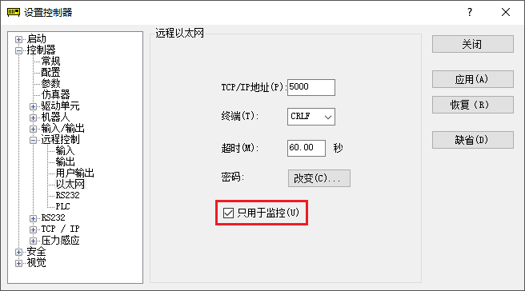

# node-red-contrib-epson-robot

简体中文 / [English](./README.md) / [日本語](./README_ja.md) / [繁體中文](./README_zh-TW.md)

本Node-RED的node，适用于爱普生公司生产的SCARA机器人和6轴机器人。

本产品包含可用于监控机器人状态的`status-monitor`node和范例流程。

如需了解更多爱普生机器人产品，请从[此页面](https://global.epson.com/products/robots/)选择您所在地区的销售公司。也可在[YouTube频道](https://www.youtube.com/channel/UCmgC2Kabv6p5ioMPH71U0PQ/)上观看产品视频。

## 安装

点击Node-RED编辑器中[菜单]-[节点管理]选项，或在Node-RED的用户目录 (通常为 `~/.node-red`)中，运行以下命令。

        npm i @epson-robots/node-red-contrib-epson-robot

运行本node需要Node-RED v1.3以上版本。

## 使用方法

`status-monitor`node通过网络连接机器人控制器，并定期收集和输出机械手及控制器状态的各项数据。

请对控制器完成以下事前准备，并在Node-RED编辑器，本node的编辑对话框中，输入并调用控制器的相关设置。

node输入/输出的相关规格，请参阅Node-RED编辑器中node的帮助文档。

### 事前准备

请参考以下步骤，开启机器人控制器的"远程以太网"功能。

1. 在电脑中安装EPSON RC+软件，连接机器人控制器后，启动软件打开设置控制器页面
1. 在[控制器]-[配置]画面中确认控制器的IP地址
1. 在[控制器]-[参数]画面中，勾选[启用机器人报警状态]选项 (仅当您需要获取有关零件消耗管理的信息时，勾选此选项)
    * **参考**: 返回的零件消耗管理的数据中，剩余使用月份和消耗量，是控制器根据机器人的所有操作，自动计算出来的结果。
    * **注意**: 本node会在建立连接后立即获得零件的消耗情况。然后每24小时重新获得一次。不会受到编辑器上node编辑对话框中设置的输出时间间隔的影响。
1. 选择[控制器]-[远程控制]-[以太网]
1. 勾选[只用于监控]选项
    * 
1. 检查TCP/IP地址和终端信息(必要时请修改) ，并根据需要设置连接密码
    * **注意**: 超时值 (默认：60.00秒)中设置的时间，应大于编辑器上node编辑对话框中设置的输出时间间隔。

完成以上设置后重启控制器。

#### 注意事项

* 请勿将控制器的控制设备设置为"远程以太网"。
* 如果有其他用户端在使用远程以太网与控制器通讯时，则无法同时使用。

### 操作环境

使用本node需要以下机器人控制器和固件版本。当固件版本不满足以下条件时，虽可以使用本node但获取并输出的信息会受限。

|机器人控制器|固件版本|
|:--|:--|
|RC700系列|Ver.7.4.7.2以上版本|
|RC90系列|Ver.7.4.7.2以上版本|
|T系列 (内置控制器一体机)|Ver.7.4.57.5以上版本|
|VT系列 (内置控制器一体机)|Ver.7.4.57.5以上版本|
|EPSON RC+ 虚拟控制器|Ver.7.4.8以上版本|

#### 注意事項

* 由于控制器固件版本和所连接机器人的限制，部分数据可能无法获取并输出。
* 使用EPSON RC+ 虚拟控制器时，即使固件版本满足上述条件，也无法正常获取零件消耗管理和CPU负载量等信息。
* EPSON RC+ 虚拟控制器的最长连续运行时间为60分钟。

## 范例

本软件包中包含一个范例流程，可将`status-monitor`node中收集到的数据，显示在Node-RED Dashboard (需要安装`node-red-dashboard`软件包)中。

请点击Node-RED编辑器中的[菜单]-[导入]-[例子]选择本软件包，导入范例流程。

请阅读流程中的`comment`文本，了解更多使用方法。

## 反馈

如果您有任何建议或疑问，请点击[GitHub Issues](https://github.com/Epson-Robots/node-red-contrib-epson-robot/issues)反馈给我们，谢谢。