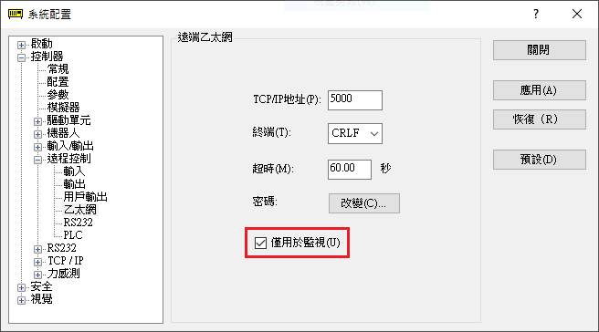

# node-red-contrib-epson-robot

繁體中文 / [English](./README.md) / [日本語](./README_ja.md) / [简体中文](./README_zh-CN.md)

此Node-RED的node適用於愛普生製造的SCARA機器人和垂直6軸機器人。

包含可以用於監視機器人狀態的方便node`status-monitor`和範例流。

有關愛普生機器人產品的詳細資訊，請選擇[此頁面](https://global.epson.com/products/robots/)中您所在地區的銷售公司。另請參閱[YouTube頻道](https://www.youtube.com/channel/UCmgC2Kabv6p5ioMPH71U0PQ/)的影片。

## 安裝

點選Node-RED編輯器中[菜單]-[節點管理]選項，或者在Node-RED使用者目錄 (通常是 `~/.node-red`)中執行以下命令。

        npm i @epson-robots/node-red-contrib-epson-robot

執行此node需要Node-RED v1.0或更高版本。

## 使用方法

`status-monitor`node透過網路連接到機器人控制器，並定期收集和輸出有關機器人和控制器狀態的各種資料。

對要連接的控制器進行以下準備作業，然後在Node-RED編輯器，此node的編輯對話方塊中輸入和調用有關控制器的配置資訊。

有關node的輸入/輸出規格的資訊，請參閱Node-RED編輯器中的node幫助文檔。

### 準備作業

按照以下步驟啟用"遠端乙太網"功能，獲取機器人控制器的資訊。

1. 在PC中安裝EPSON RC+軟體，連接機器人控制器然後啟動配置控制器熒幕
1. 檢查[控制器]-[配置]熒幕中的控制器IP位址
1. 勾選[控制器]-[參數]熒幕中的[啟動機器人維護資料]核取方塊 (可選:如果需要有關零件耗用管理的資訊，請勾選)
    * **參閱**: 零件耗用管理資訊輸出的剩餘月數和耗用量，是控制器内部根據機器人操作的各種資訊自動計算的結果。
    * **注意**: 此node在連接后將立即獲取一次零件耗用資訊，然後每24小時重新獲取一次。編輯器node編輯對話方塊中設定的輸出時間間隔不受影響。
1. 點選[控制器]-[遠程控制]-[乙太網]
1. 勾選[僅用於監視]核取方塊
    * 
1. 檢查TCP/IP位址和終端 (如需要請更改)，根據需要設定連接密碼
    * **注意**: 超時的設定值 (預設值：60.00秒)應大於編輯器node編輯對話方框中設定的輸出時間間隔。

完成以上更改重新啟動控制器。

#### 注意事項

* 不要將控制器的控制設備設定爲"遠端乙太網"。
* 如果還有其他客戶終端使用遠端乙太網和控制器通訊，則不能同時使用。

### 作業環境

此node的作業環境需要以下機器人控制器和韌體版本。此node在舊固件版本仍然有效，但是可以獲取的資訊有限。

|機器人控制器|韌體版本|
|:--|:--|
|RC700系列|Ver.7.4.7.2或更高版本|
|RC90系列|Ver.7.4.7.2或更高版本|
|T系列 (内建控制器)|Ver.7.4.57.5或更高版本|
|VT系列 (内建控制器)|Ver.7.4.57.5或更高版本|
|EPSON RC+ 模擬控制器|Ver.7.4.8或更高版本|

#### 注意事項

* 根據控制器的韌體版本和連接機器人的類型，某些資訊可能無法獲取並輸出。
* 使用EPSON RC+ 模擬控制器，即使滿足以上版本的要求，也無法正確收集和輸出零件耗用管理和CPU負載率等資訊。
* EPSON RC+ 模擬控制器的連續運行時間為60分鐘。

## 範例

此軟體程式集包含一個範例流，可以將`status-monitor`node收集的資訊可視化顯示在Node-RED Dashboard (需要安裝`node-red-dashboard`軟體程式集)中。

點選Node-RED編輯器[菜單]-[匯入]-[例子]，選擇本軟體程式集，可以匯入顯示的範例流。

有關如何使用，請參閱範例流中包含的`comment`node。

## 回饋

有關Bug資訊和疑問，請發送到[GitHub Issues](https://github.com/Epson-Robots/node-red-contrib-epson-robot/issues)。